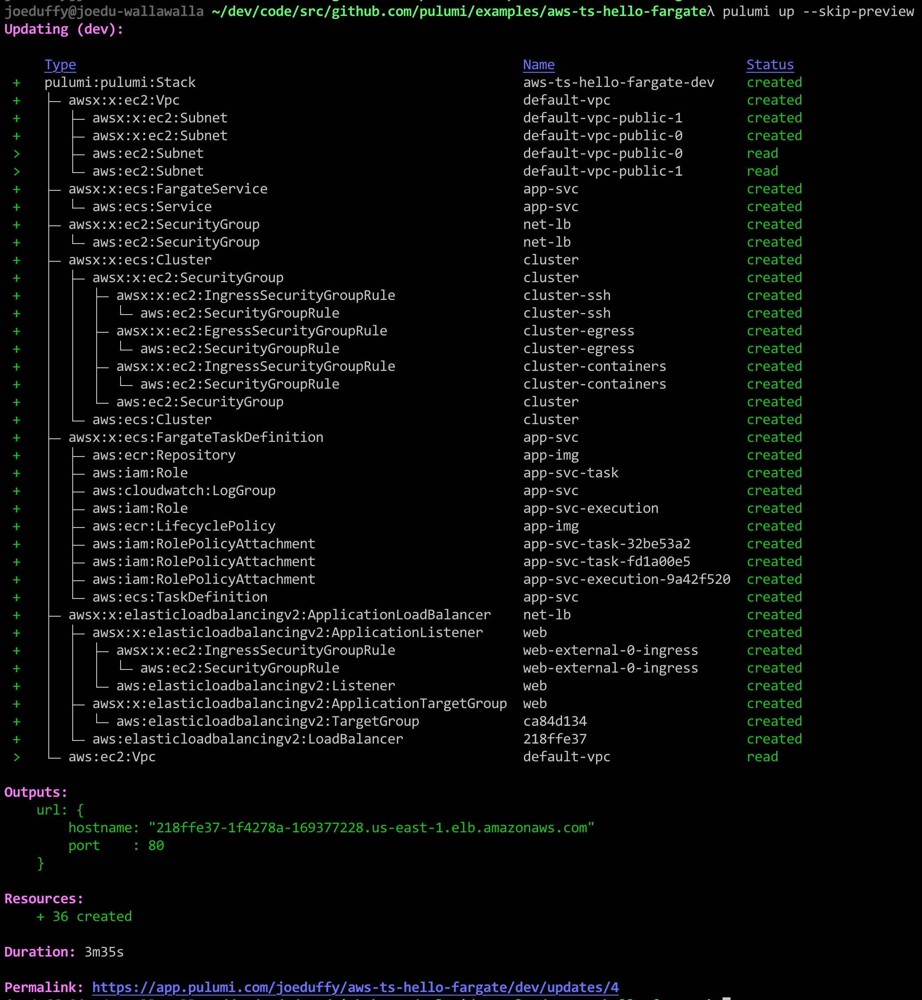
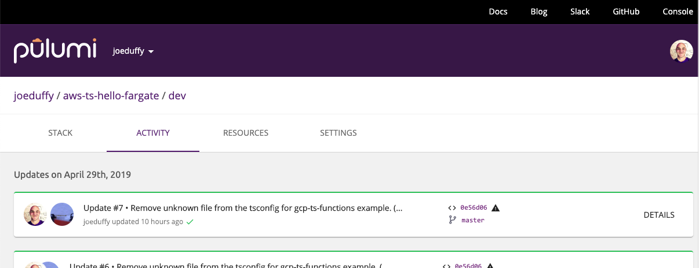

> Update: Check out the [Learning Machine Case Study]() where provisioning went from 3 weeks to 1 hour with Pulumi and AWS.
> ** "The impact of serverless capabilities was also transformative for the Learning Machine business. Pulumi enabled a rapid shift to Amazon ECS, AWS Fargate and AWS Lambda — the net effect of which was a 67% reduction in AWS charges. This enabled the team to spend less time focused on maintaining existing infrastructure and more time deploying new applications on AWS and adding new customers.
>
> “Pulumi is the foundational technology that allowed us to transform our organization,” said Hughes. The entire DevOps process was streamlined and in addition to realizing better productivity and higher quality, the team has new insight into their SaaS offering that they never thought possible."**

<!--more-->

The [Docker Getting Started tutorial](https://docs.docker.com/get-started/) shows how to develop,
build, and run a modern containerized application, from a single custom
Docker container published to the Docker Hub, to a scaled out service
with load balancing. But there are challenges: it requires you to
program in YAML, run (or script) many CLI commands, and manage your own
Swarm or Kubernetes cluster. There is an easier way. By using Pulumi's
infrastructure as code, we can build a custom Docker image, publish it
to a private AWS container registry, and spin up an AWS Fargate load
balanced service running that container, all in 28 lines of TypeScript
code and a single `pulumi up` command. The result leverages the best of
what AWS has to offer, with the entire platform at your fingertips, with
a single approach. In this article, we'll see how.

## Defining Everything in Code

The Docker Getting Started tutorial goes from a simple developer desktop
scenario to a fully scaled out service in production. There is a lot of
ceremony, however: YAML, many CLI commands, running your own Swarm
cluster by hand, etc. This is complicated and doesn't lend itself to
repeatable deployments across many environments.

What if we could just write 28 lines of TypeScript instead, and
accomplish the same end result, while leveraging the latest innovations
in the AWS platform, natively?

In fact, we can. This article will show you how Pulumi's infrastructure
as code solution enables exactly this.

> ***Note:** Everything we're about to define will be in a single
> TypeScript file, `index.ts`. Other languages are available, including
> using plain Node.js JavaScript. Pulumi also supports other clouds,
> including Azure and GCP, however to fully exploit the power of the
> underlying AWS platform, these examples will leverage native
> capabilities like VPCs, ALBs, and
> Fargate.

To cut to the chase, here is the entire program. We'll spend the rest of
the post walking through it line by line:

```typescript
import * as awsx from "@pulumi/awsx";

// Step 1: Create an ECS Fargate cluster.
const cluster = new awsx.ecs.Cluster("cluster");

// Step 2: Define the Networking for our service.
const alb = new awsx.lb.ApplicationLoadBalancer(
    "net-lb", { external: true, securityGroup: cluster.securityGroup });
const web = alb.createListener("web", { port: 80, external: true });

// Step 3: Build and publish a Docker image to a private ECR registry.
const img = awsx.ecs.Image.fromPath("app-img", "./app");

// Step 4: Create a Fargate service task that can scale out.
const appService = new awsx.ecs.FargateService("app-svc", {
    cluster,
    taskDefinitionArgs: {
        container: {
            image: img,
            cpu: 102 /*10% of 1024*/,
            memory: 50 /*MB*/,
            portMappings: [ web ],
        },
    },
    desiredCount: 5,
});

// Step 5: Export the Internet address for the service.
export const url = web.endpoint.hostname;
```

## Step 1. Create a Cluster

The opening stanza imports Pulumi's
[open source AWSX NPM package](), `@pulumi/awsx`. It
contains high level AWS best practices and patterns, and leverages real
languages to eliminate boilerplate YAML templating:

```typescript
import * as awsx from "@pulumi/awsx";
```

To provision an entire [Elastic Container Service (ECS)](https://aws.amazon.com/ecs/) cluster, AWS's native container
orchestration technology, we just new one up in a single line of code:

```typescript
const cluster = new awsx.ecs.Cluster("cluster");
```

This will use the default [Virtual Private Cloud (VPC)](https://aws.amazon.com/vpc/) in our account. If we want to
customize this aspect along with the auto-scaling policies, we can
easily override the defaults by passing the appropriate arguments.

## Step 2. Define the Networking

Next we need to think about the networking for our desired application.
First, we will need a load balancer, as we're going to create a
scaled-out application and want a fixed address. Second, we will want to
expose port 80 to the Internet, for incoming traffic. This leads to
these two lines:

```typescript
const alb = new awsx.lb.ApplicationLoadBalancer(
    "net-lb", { external: true, securityGroups: cluster.securityGroups });
const web = lb.createListener("web", { port: 80, external: true });
```

An [Elastic Application Load Balancer (ALB)](https://aws.amazon.com/elasticloadbalancing/) in AWS is a
[fully featured Layer 7 load balancer](https://aws.amazon.com/blogs/aws/new-aws-application-load-balancer/),
with advanced features around SSL termination, content based routing,
and HTTP/2. The AWSX package enables you to whip together simple routing
when appropriate, while still having the ability to dig deeper into the
advanced capabilities as you scale your workload to handle more
sophisticated scenarios. Simple things simple, hard things possible!

## Step 3. Build and Publish the Container Image

The next line declares a Docker image:

```typescript
const img = awsx.ecs.Image.fromPath("app-img", "./app");
```

This single line is quite the work horse, and does a lot. Let's unpack
it a bit.

First and foremost, this allocates a private [Elastic Container Registry (ECR)](https://aws.amazon.com/ecr/) repository for your Docker
image. This is AWS's hosted Docker registry solution, privately
encapsulated inside your AWS account.

But there is more: this also builds the `Dockerfile` underneath `./app`
and publishes the result to said registry, each time you run
`pulumi up`! Any `Dockerfile` will work. This means you get a single
command line to both provision and update your infrastructure, in
addition to publishing and rolling out your images.

## Step 4. Create a Scale-Out Service

Next up, let's deploy our published image as a containerized service,
behind our load balanced network on port 80, using our [ECS Fargate](https://aws.amazon.com/fargate/) cluster. Fargate is a managed
container orchestrator that lets us skip the messy details of installing
and managing Swarm on our own. This effectively replaces
[the **docker-compose.yml** from the Docker Getting Started tutorial](https://docs.docker.com/get-started/part3/), with a similarly
simple sequence of code, and which gives us full access to the AWS
platform:

```typescript
const appService = new awsx.ecs.FargateService("app-svc", {
    cluster,
    taskDefinitionArgs: {
        container: {
            image: img,
            cpu: 128 /*~10%*/,
            memory: 50 /*MB*/,
            portMappings: [ web ],
        },
    },
    desiredCount: 5,
});
```

Notice that `img` just refers to the Docker image built in Step 3, and
the `portMappings` structure references our load balancer's listener
defined in Step 2. Pulumi tracks all the dependencies so that it knows
how to perform deployment activities in the right order. The task
definition structure here exposes
[all of the underlying AWS ECS capabilities](https://docs.aws.amazon.com/AmazonECS/latest/userguide/fargate-task-defs.html).

## Step 5. Deploy the App and Kick the Tires!

On to the final step! Let's deploy our infrastructure and application,
and kick the tires.

The last line of code exposes the load balancer address so it's easy to
access:

```typescript
export const url = web.endpoint.hostname;
```

The net result is that, with this project defined with the 28 lines of
code above, we can simply run `pulumi up`; this command will show us a
preview of the changes it will make and then, once confirmed, deploy
everything to our AWS account, and hand back our service's hostname:



After deploying everything, you've got a fully functioning application.
To give it a try, let's grab the URL exported by our program from the
stack output command, and `curl` it:

    $ curl http://$(pulumi stack output url)
    <h3>Hello World!</h3>
    <b>Hostname:</b> ip-172-31-39-18.ec2.internal<br/>
    <b>Visits:</b> <i>cannot connect to Redis, counter disabled</i>

Or open it in our web browser:

    $ open http://$(pulumi stack output url)


For more details on how to enable Redis and other advanced options for this
sample application, please
[see the instructions on the Docker Getting Started guide](https://docs.docker.com/get-started/part6/).

As an added bonus, the entire time we are doing these deployments, the
Pulumi Service is keeping track of deployment state, to ensure
everything works reliably and in a team setting, similar to how Git
works with GitHub. For example, I can see a history of my deployments:



## Congratulations!

In this article, you've seen how to take 28 lines of code, and turn
them, plus a Dockerfile, into a fully functioning AWS microservice,
including the infrastructure and application resources. No YAML
required, no complex sequence of CLI commands, and no manual cluster
installation.

Pulumi's "everything is code" approach means deploying everything can be
done with a CLI command, unlocking the power of the entire Docker
platform with a great inner development loop, that works from the
desktop all the way to production. This entire flow can be
[easily integrated into your favorite CI/CD pipeline](),
including GitOps workflows.

If we want to augment our service with other AWS resources -- like S3
buckets, Aurora or RDS databases, Lambda functions, CloudWatch
dashboards, etc -- they can be provisioned and managed the same was
created our clusters and load balancers: just `new` them up!

Remember that all of this not only works for native AWS ECS containers,
but also Azure and GCP cloud providers, in addition to Kubernetes!

Want to go deeper?

- [Check out this example on GitHub](https://github.com/pulumi/examples/tree/master/aws-ts-hello-fargate)
- [Get Started with your favorite cloud and scenario now]()
