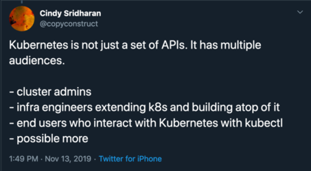
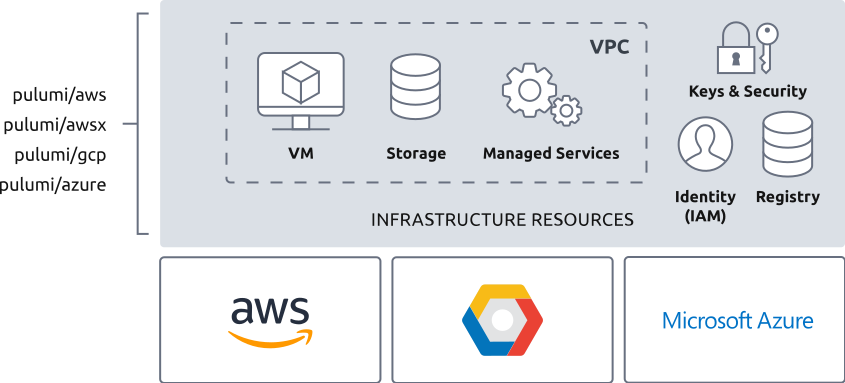

Running Kubernetes in production can be challenging. However, there are common patterns of usage informed by best practices that we can use to successfully run applications on Kubernetes in production. Pulumi has collected these common patterns into playbooks. Crosswalk for Kubernetes is a collection of playbooks to configure, deploy, and manage Kubernetes in production.

## Kubernetes is Vast and Full of Complexity




Kubernetes is the platform for modern applications. Kubernetes usage has grown by 50% in just six months according to a [DZone article](https://dzone.com/articles/survey-reveals-rapid-growth-in-kubernetes-usage-se). There also a strong trend for public cloud container adoption shifting to [Kubernetes](https://www.tigera.io/blog/top-6-kubernetes-trends-for-2019/).

Rapid adoption of a complex platform such as Kubernetes presents challenges. For example, enterprise teams can take six to twelve months to on-ramp to Kubernetes, containers, and the cloud before their application goes into production. Once deployed, misconfigured infrastructure accounts for 40 to 50% of [production outages](https://danluu.com/postmortem-lessons/).

Managed Kubernetes clusters, such as AWS Elastic Kubernetes Services (EKS), Azure Kubernetes Services (AKS), Google Kubernetes Engine and Digital Ocean, have become popular because of the complexity of building and maintaining clusters. However, managed Kubernetes solutions are vanilla and require adding and configuring additional resources to deploy an application in production.

## How Crosswalk for Kubernetes Is Organized

Over the course of a year, the Pulumi team has been working with customers and open source users of our infrastructure as code tools for Kubernetes. What we’ve seen are common patterns that we’ve distilled into six distinct playbooks realized as [stacks](https://www.pulumi.com/docs/intro/concepts/stack/).



### Identity 

Establishing identities and roles for organizations and CI/CD is a requirement of every production. An identity stack contains identities and roles for the team and service accounts for CI/CD and bots that automate processes. Each cloud provider establishes identity in their own way and the guide provides instructions for [AWS IAM](https://aws.amazon.com/iam/), [GCP IAM](https://cloud.google.com/iam/), and [Azure AD](https://azure.microsoft.com/en-us/services/active-directory/). Example code is available for each cloud provider: [AWS Identity and Access Management](https://github.com/pulumi/kubernetes-guides/tree/master/aws/01-identity), [GCP Identity and Access Management](https://github.com/pulumi/kubernetes-guides/tree/master/gcp/01-identity), [Azure Active Directory](https://github.com/pulumi/kubernetes-guides/tree/master/azure/01-identity).

### Managed Infrastructure

The current trend is to deploy infrastructure on a managed cloud provider. While there are benefits to using managed infrastructure, provisioning is still required to configure a cluster. At minimum this requires building networking infrastructure, storage backends and any number of resources such as CMS, registries, and data pipelines.’

Crosswalk for Kubernetes covers in detail two of the most common tasks: configuring networking and storage. Kubernetes will typically use private subnets for load balances, private subnets for workers and managed Pod networking. Another requirement of Kubernetes is storage which provides data persistence through either shared storage and or volumes for Pods. There are many types of volumes and they vary from cloud provider but can generally be divided into mechanical drives and SSDs and network backed storage such as CephFS or NFS.

The guide provides [instructions](https://www.pulumi.com/docs/guides/crosswalk/kubernetes/control-plane/#managed-infrastructure) and full code examples to implement managed infrastructure stacks for both networking for [AWS](https://github.com/pulumi/kubernetes-guides/tree/master/aws/02-managed-infra), [Azure](https://github.com/pulumi/kubernetes-guides/tree/master/azure/02-managed-infra), and [GCP](https://github.com/pulumi/kubernetes-guides/tree/master/gcp/02-managed-infra). 

### Cluster Configuration


Managed Kubernetes services such as AWS EKS, Azure AKS, and Google GKE provide a simple way to deploy a vanilla Kubernetes cluster. The cluster requires cluster-wide services to be used in production, this includes creating resources for the application and logically segmenting the cluster and setting policies and quotas. 

The guide demonstrates how to create names for [cluster services](https://www.pulumi.com/docs/guides/crosswalk/kubernetes/configure-defaults/#namespaces) such as logging and monitoring, application services like ingress and DNS services , and applications. An example for [resource quotas](https://www.pulumi.com/docs/guides/crosswalk/kubernetes/configure-defaults/#quotas)  across all Pods in a namespace, and a how to set [PodSecurityPolicies](https://www.pulumi.com/docs/guides/crosswalk/kubernetes/configure-defaults/#podsecuritypolicies) for setting cluster level security controls. Complete examples for [AWS](https://github.com/pulumi/kubernetes-guides/tree/master/aws/03-cluster-configuration), [Azure](https://github.com/pulumi/kubernetes-guides/tree/master/azure/03-cluster-configuration), and [GCP](https://github.com/pulumi/kubernetes-guides/tree/master/gcp/03-cluster-configuration) are on Github.

### Cluster Services


Cluster services are scoped at the [Kubernetes cluster](https://kubernetes.io/docs/concepts/cluster-administration/cluster-administration-overview/) level. Common cluster services are logging, monitoring, policy enforcement, container registries and service meshes. The [guide](https://www.pulumi.com/docs/guides/crosswalk/kubernetes/cluster-services/) provides an example of how to configure logging and monitoring, including how to setup Datadog to aggregate node and container metrics and events. Examples are also provided on how to configure native cloud provider logging solutions. Full examples are available for [AWS](https://github.com/pulumi/kubernetes-guides/tree/master/aws/04-cluster-services) and [Azure](https://github.com/pulumi/kubernetes-guides/tree/master/azure/04-cluster-services) on Github.

### Application Services

Applications require additional services such as ingres controllers, DNS and TLS, and data stores. The guide covers how to implement [datastores](https://www.pulumi.com/docs/guides/crosswalk/kubernetes/app-services/#datastores) and general application services such as a [NGINX ingress controller](https://www.pulumi.com/docs/guides/crosswalk/kubernetes/app-services/#nginx-ingress-controller).  

Configuring data storesis is a common task. The [AWS example](https://github.com/pulumi/kubernetes-guides/tree/master/aws/05-app-services) and the [GCP example](https://github.com/pulumi/kubernetes-guides/tree/master/gcp/05-app-services) shows how to deploy and configure PostgreSQL and Redis. The [Azure example](https://github.com/pulumi/kubernetes-guides/tree/master/azure/05-app-services) example demonstrates how to deploy Cosmos DB and MongoDB.

### Applications

Deploying applications can involve many types of tasks, ranging from building and deploying apps in a container, deploying with Helm charts, deploying a job, a DaemonSet, and StatefulSet. One of the most common tasks in a microservices architecture is [building a container, pushing it to a registry and deploying it to Kubernetes](https://www.pulumi.com/docs/guides/crosswalk/kubernetes/apps/#build-and-deploy-a-container). For comparison, the example is written in typescript with just the the Pulumi for Kubernetes library and the the Kubernetes Crosswalk. Note the difference in deployment.

Pulumi for Kubernetes

```typescript
// Create a Deployment of the built container.
const appLabels = { app: customImage };
const appDeployment = new k8s.apps.v1.Deployment("app", {
    spec: {
        selector: { matchLabels: appLabels },
        replicas: 1,
        template: {
            metadata: { labels: appLabels },
            spec: {
                containers: [{
                    name: customImage,
                    image: appImage,
                    ports: [{name: "http", containerPort: 80}],
                }],
            }
        },
    }
}, { provider: provider });
```

Crosswalk for Kubernetes

```typescript
// Define the Pod for the Deployment.
const pb = new kx.PodBuilder({
    containers: [{
        image: appImage,
        ports: { "http": 80 },
    }],
});

// Create a Deployment of the Pod defined by the PodBuilder.
const appDeploymentKx = new kx.Deployment("app-kx", {
    spec: pb.asDeploymentSpec(),
}, { provider: provider });
```

There are many more [application examples](https://www.pulumi.com/docs/guides/crosswalk/kubernetes/apps/#overview) in the Guide. Complete [code examples](https://github.com/pulumi/kubernetes-guides) for building and deploying a container in a Kubernetes cluster are available on Github. Additional application examples for other [common application tasks](https://github.com/pulumi/kubernetes-guides/tree/master/apps) are also available on Github.

